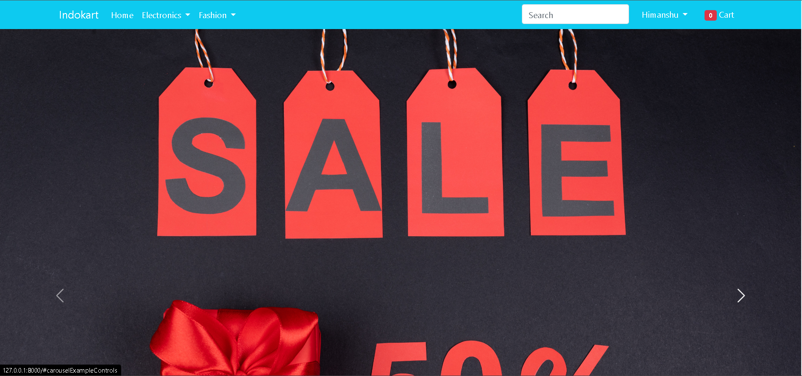

# Indo-Kart
Indo-Kart is a fully responsive e-commerce website with integration of _Payment Gateway_.

***
## How to run on a Local Machine

1. Clone to your Machine
```
git clone https://github.com/himanshusuryawanshi/Indo-Kart.git

```
2. Create a Virtual Environment
    * If you don't have virtualenv installed on local machine
    ```
    pip install virtualenv
    ```
    * Create Virtual Environment
    ```
    python -m virtualenv venv
    ``` 
    * Activate Virtual Environment
    ```
    .\venv\Scripts\activate
    ```

3. Install all dependencies in virtual environment
 ```
 pip install -r requirements.txt
 ```

4. Run the Project
```
python manage.py runserver
```

## Demo

Landing Page



Mobile Page

